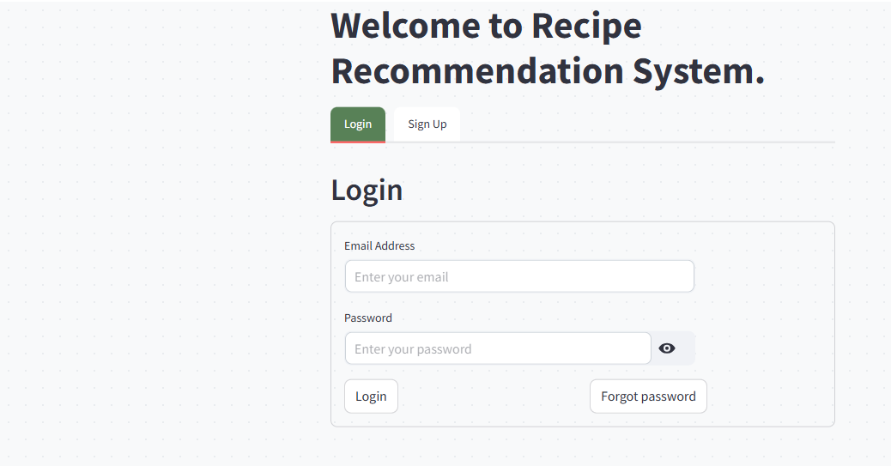
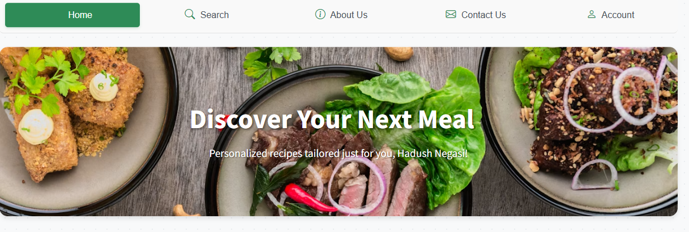
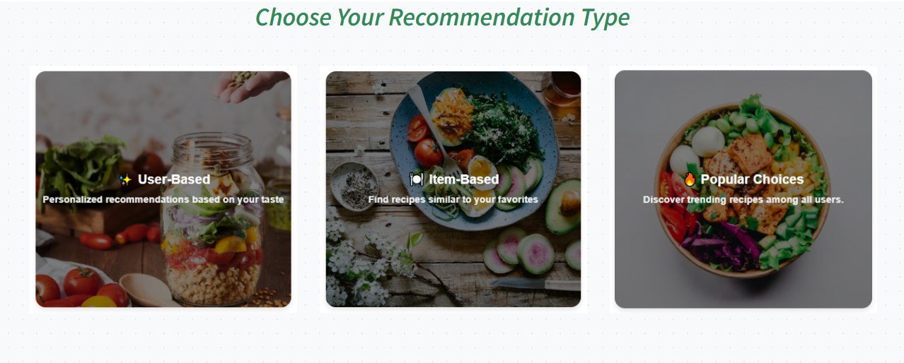
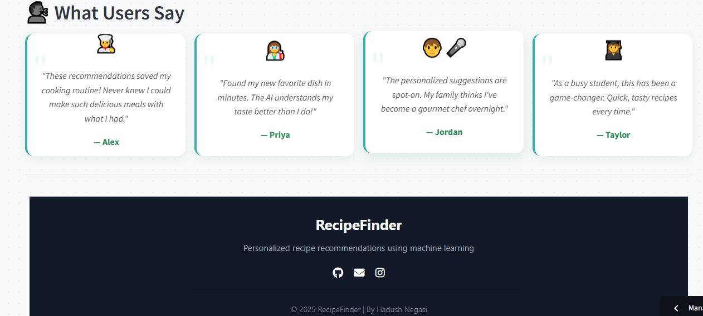

# Recipe Recommender 🍳

A recipe recommendation system that helps users discover new dishes based on their available ingredients and preferences using collaborative or content-based filtering.

## Table of Contents
- [Features](#features)
- [Installation](#installation)
- [Usage](#usage)
- [Screenshots](#screenshots)
- [Technologies Used](#technologies-used)
- [Project Structure](#project-structure)
- [Contributing](#contributing)
- [License](#license)

## Features
- 🔐 User authentication via Firebase  
- 🍽️ Recommend recipes based on user preferences  
- 🧂 Ingredient-based recipe search  
- ⭐ Popular recipes section  
- 🔄 User-based and item-based collaborative filtering  
- 🖥️ Streamlit interface with an intuitive layout  

## Installation

1. **Clone the repository**:
   ```bash
   git clone https://github.com/hadush-negasi/recipe-recommender.git
   cd recipe-recommender
   ```

2. **Create a virtual environment and install dependencies**:
   ```bash
   python -m venv myenv
   myenv\Scripts\activate      # On Windows
   # or
   source myenv/bin/activate   # On Linux/Mac

   pip install -r requirements.txt
   ```

3. **Set up Firebase**:
   - Go to [Firebase Console](https://console.firebase.google.com/) and create a new project.
   - Navigate to **Project Settings > Service Accounts** and click **Generate new private key**.
   - Download the `firebase-credentials.json` file and place it in the root project directory.
   - Copy the **Web API Key** from **Project Settings > General**.

4. **Create a `.env` file** in the root directory and add:
   ```env
   FIREBASE_CREDENTIALS=firebase-credentials.json
   WEB_API_KEY=your_firebase_web_api_key
   ```

   ⚠️ **Important**: Add `.env` and `firebase-credentials.json` to `.gitignore` to avoid committing sensitive data.

5. **Run the app**:
   ```bash
   streamlit run main.py
   ```

## Usage

1. **Login / Signup**  
   - On launch, you’ll be prompted to log in or register.  
   - Authentication is handled via Firebase.  
   - After login, you’ll land on the homepage.  

2. **Home Page Overview**  
   - Choose from 3 recommendation options:  
     - User-based  
     - Item-based  
     - Popular Recipes  
   - Each is shown as a clickable card.  

3. **View Recommendations**  
   - Each recommended recipe includes an image, title, and short description.  
   - Click **View Recipe** to see full details including ingredients, instructions, and a feedback form.  

4. **Navigation Bar**  
   - Use the top navbar to access:  
     - 🔍 **Search** (for content-based search)  
     - 📄 **About Us**  
     - 📬 **Contact Us**  
     - 👤 **Account** (view/edit profile)  

## Screenshots

### 🔐 Login Page  


---

### 🏠 Home Page with Recommendation Options  
  
  


---

### 📋 Recipe Recommendations  


---

### 🍽️ Full Recipe Details with Feedback Form  


---

### 🧂 Ingredient-based Search  


---

### 👤 Account Page (Edit Profile)  


## Technologies Used

- [Streamlit](https://streamlit.io/) – UI framework  
- [Firebase](https://firebase.google.com/) – Auth & Realtime Database  
- [Pandas](https://pandas.pydata.org/) – Data manipulation  
- [Scikit-learn](https://scikit-learn.org/) – Similarity calculation  
- [Python](https://www.python.org/) – Core language  

## Project Structure

```
recipe-recommender/
│
├── main.py                   # Entry point for the Streamlit app
├── recipe_recommend.py       # User/Item-based recommendation logic
├── recipe_search.py          # Content-based recipe search
├── data_loader.py            # Loads dataset
│
├── data/
│   ├── recipes_clean.feather
│   ├── reviews_df.feather
│   ├── user_pred.feather
│   └── item_pred.feather
│
├── pages/
│   ├── About.py
│   ├── Contact.py
│   └── Search.py
│
├── screenshots/              # Screenshots for README
│   ├── login.png
│   ├── homepage1.png
│   ├── homepage2.png
│   ├── homepage3.png
│   ├── recommendation_view.png
│   ├── recipe_detail.png
│   ├── recipe-search.png
│   └── account_edit.png
│
├── firebase-credentials.json # Firebase key (not committed)
├── .env                      # Env vars for Firebase (not committed)
├── .gitignore                # Ignore sensitive files
├── requirements.txt          # Project dependencies
└── README.md                 # You're reading it!
```

## Contributing

Pull requests are welcome! For major changes, please open an issue first to discuss what you’d like to change.

## License

This project is licensed under the [MIT License](LICENSE).
